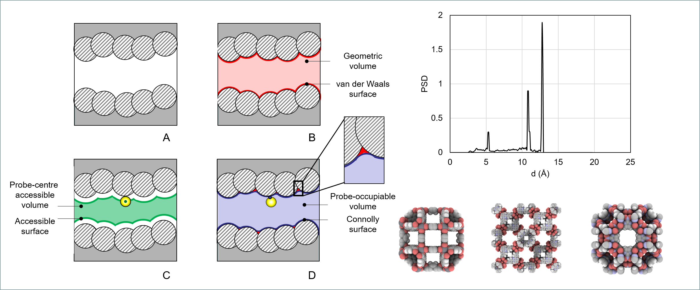

# PoreBlazer
PoreBlazer (v4.0) source code, examples, and geometric properties of porous materials calculated for the subset of 12,000 structures from the CSD MOF.

## 1. Contents
- Folder: **src**

Folder containing the complete source code, precompiled executables and associated README_PB_v4.0.txt file with the instructions on how to compile and use the code (see also "How to" below).

- Folder: **data** 

Files containing databases of MOFs and their properties, MOFsubsetPB4.dat, MOFsubsetZeo++.dat, MOFsubsetRASPA.dat

- Zip file containing complete setup examples for three case study materials HKUST-1, IRMOF-1, ZIF-8: **PB4_vs_Zeo++_vs_RASPA.zip**

- Zip file containing a larger collection of case studies (MOFS, zeolites): **case_studies.zip**

## 2. How to
To download the distribution, clone the PoreBlazer repository:
```bash
git clone https://github.com/SarkisovGroup/PoreBlazer
cd PoreBlazer
cd src
```

Executable poreblazer_gfortran.exe was compiled on Intel Xeon E5-2630 v3 @2.40Hz processor, 
using gfortran compiler GNU Fortran (GCC) 4.8.5. The poreblazer_intel.exe was compiled using 17.0.4 version of 
Intel Fortran compiler. These executables should be compatible with most Intel platforms. 

If you wish to compile your own version go to the next step.

2.1 **Compiler**. The Makefile is also provided. To change compiler from gfortran to intel, in the line
```bash
FORTRAN_COMPILER= gfortran
```
change gfortran to the intel compiler executable name on your system. 

2.2 **Make**.To compile the code you can simply issue a **"make"** command, which 
will follow the instructions in the Makefile to assemble the code into the
**poreblazer.exe** executable file.

2.3 **Other compilers**. The code has been tested with Intel fortran compiler and 
gfortran. Compilation and testing using other compilers is at the 
discretion of the users. The mutual file dependency is summarized at the 
end of the Makefile for custom compilations.

The distribution also contains the following case studies (**case_studies.zip**):

MOFs: CD121, HKUST1, IRMOF1, MOF180, MIL47V, MIL101, ZIF8

Zeolites: BHP, CLO, LOV, ROG, RON, STO, WEI

Other: Slit

with reference results and performance.

2.3 **How to run**

2.3.1 *Basic mode*

In basic mode the program uses default parameter setting. For this, in the 
location of the run, you need to put files defaults.dat and UFF.atoms. 
They can be copied from the case studies provided with the 
distribution and are the same for all runs. All that a user needs to 
specify is the name of the file containing the xyz coordinates of the 
structure (which uses the standard names for the elements, H, C, 
O etc) and dimensions of the unit cell (side lengths and yz, xz, xy angles. 
For example, for HKUST1, it is specified in the input.dat file:

```bash
HKUST1.xyz
26.28791        26.28791        26.28791
90             90             90
```

To run simply issue:

```bash
./poreblazer.exe < input.dat
```
Examples of the output are summarized in the provided case studies. 

2.3.2 *Advanced mode*

In the advanced mode, a user controls various parameters of the simulation, 
such as the interaction parameters of Nitrogen and Helium atoms, cut-off 
radius, grid size etc. All the parameters are specified in the defaults.dat 
file and can be changed there. This file also specifies a source of the 
force field parameters for the atoms of the structure. By default it is the 
UFF forcefield, provided in UFF.atoms file (note that not all possible 
atoms from the UFF are there, but the most common ones). Other force fields 
and files can be used, with the customized convention for the atom names 
defined by the user. 

This mode assumes the user knows what s/he does. Here is an example of the 
defaults.dat file:

```bash
UFF.atoms		Default forcefield: UFF
2.58, 10.22, 298, 12.8	Parameters for the helium atom probe s (Å) and e(K), temperature T (K), required for the Helium porosimetry, and cut-off distance (Å), required for the Helum porosimetry
3.314			Nitrogen atom probe s (Å)
500			Number of trials per atom for the surface area calculation
0.2			Cubelet size
20.0, 0.25		Largest anticipated pore diameter (Å), size of the bin for PSD (Å)
21908391		Rand number generator seed
0			Network-accessible nitrogen probe-centre visualization options: 0 – no network visualization files; 1 – xyz format; 2- grd format; 3 – both xyz and grd format
```


2.3.3 *Understanding and interpreting the results*

Results are printed on the screen, and can be redirected to a text file. They are also summarized in
summary.dat file. Here is an example from HKUST1 with an explanation on what is what:

```bash
HKUST1.xyz					Name of the structure, file
V_A^3                       	18166.371	Volume of the system, V, Å
M _g/mol                    	9674.208	Molecular weight of the unit cell, g/mol
RHO_g/cm^3         		0.884		Density, g/cm3
PLD_A                          	6.38		Pore limiting diameter, Å
LCD_A                          	12.86		Largest cavity dimeter, Å
D                               3		Number of directions the system is percolated in
Total	The next properties are total properties
S_AC_A^2                   	2989.37		Accessible surface area, S_(AC,T), Å2
S_AC_ m^2/cm^3      		1645.55		Accessible surface area, S_(AC,T), m2/cm3
S_AC_m^2/g               	1860.87		Accessible surface area, S_(AC,T), m2/g
Total   The next properties are total properties
V_He_A^3                  	13419.839	Helium pore volume, V_(He,T), Å3
V_He_cm^3/g           		0.835		Helium pore volume, V_(He,T), cm3/g
V_G_A^3                    	12757.117	Geometric pore volume, V_(G,T), Å3
V_G cm^3/g:               	0.794		Geometric pore volume, V_(G,T), cm3/g
V_PO A^3:                   	12243.005	Probe-occupiable pore volume, V_(PO,T), Å3
V_PO cm^3/g:             	0.762		Probe-occupiable volume, V_(PO,T), cm3/g
FV_PO:                         	0.67394		Volume fraction, , V_(PO,T)/V
Network-accessible  	The next properties are network-accessible properties
S_AC_A^2                   	2904.59		Accessible surface area, S_(AC,A), Å2
S_AC_m^2/cm^3      		1598.88		Accessible surface area, S_(AC,A), m2/cm3
S_AC_m^2/g              	1808.09		Accessible surface area, S_(AC,A), m2/g
Network-accessible  	The next properties are network-accessible properties
V_He_A^3                  	13419.839	Helium pore volume, V_(He,A), Å3
V_He_cm^3/g            		0.835		Helium pore volume, V_(He,A), cm3/g
V_G_A^3                    	12755.759	Geometric pore volume, V_(G,A), Å3
V_G cm^3/g:             	0.794		Geometric pore volume, V_(G,A), cm3/g
V_PO A^3:                 	12186.852	Probe-occupiable pore volume, V_(PO,A), Å3
V_PO cm^3/g:           		0.759		Probe-occupiable volume, V_(PO,A), cm3/g
FV_PO:                      	0.67085		Volume fraction, V_(PO,A)/V
```
Additionally, the code will generate the following files:
- Total_psd_cumulative.txt                  	Total cumulative Pore Size Distribution
- Total_psd.txt                             	Total pore size distribution
- Network-accessible_psd_cumulative.txt		Network-accessible cumulative PSD
- Network-accessible_psd.txt			Network-accessible PSD
- probe_occupialbe_volume.xyz  			Points sampled within the network-accessible probe-occupiable volume
- nitrogen_network.xyz                      	Network-accessible nitrogen probe-centre visualization in xyz format (requires correct option in defaults.dat)
- nitrogen_network.grd				Network-accessible nitrogen probe-centre visualization in grd format (requires correct option in defaults.dat)


## Screenshots



## Contributing
When contributing to this repository, please first discuss the change you wish to make via issue, email, or any other method with the owners of this repository before making a change. 

## **Contact Us**
**Email**: 
[Lev Sarkisov](mailto:lev.sarkisov@manchester.ac.uk) <br>
**Address:** <br>
The Department of Chemical Engineering and Analytical Science <br>
The University of Manchester <br> 
Sackville Street <br> 
Manchester, M13 9PL 


## License
This project is licensed under the terms of the GNU General Public License as published by
the Free Software Foundation, either version 3 of the License, or at your option) any later version.

## Acknowledgments
<p> 
  
</p>


